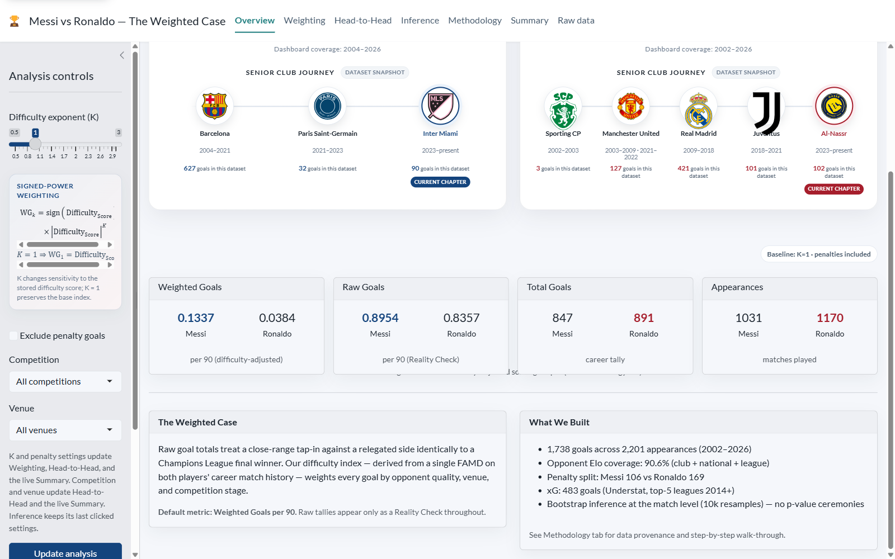
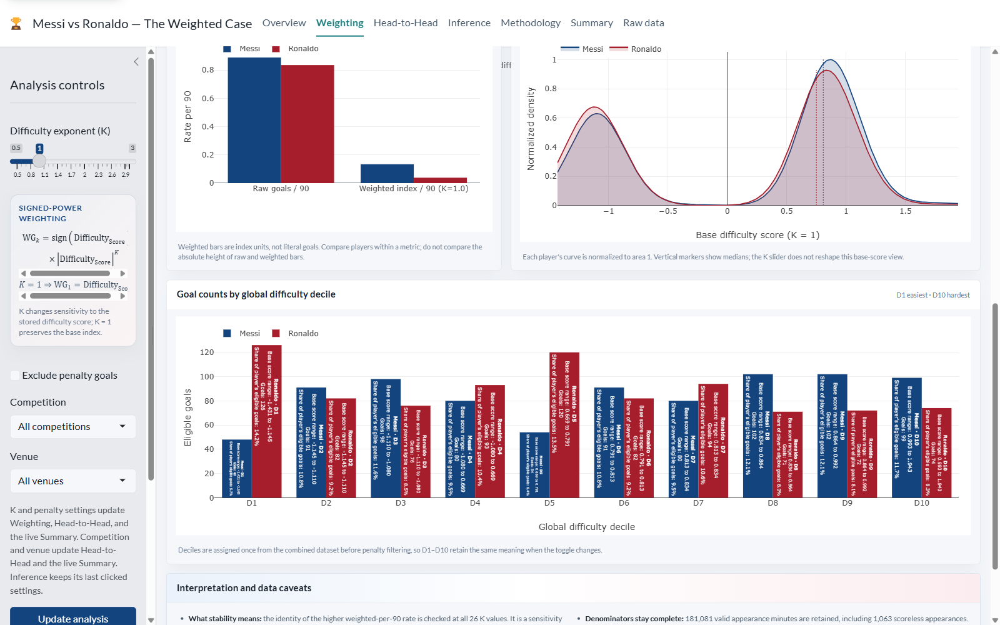
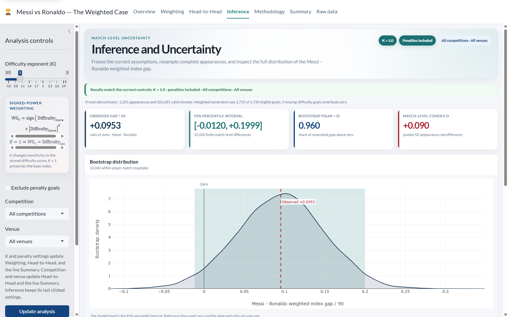
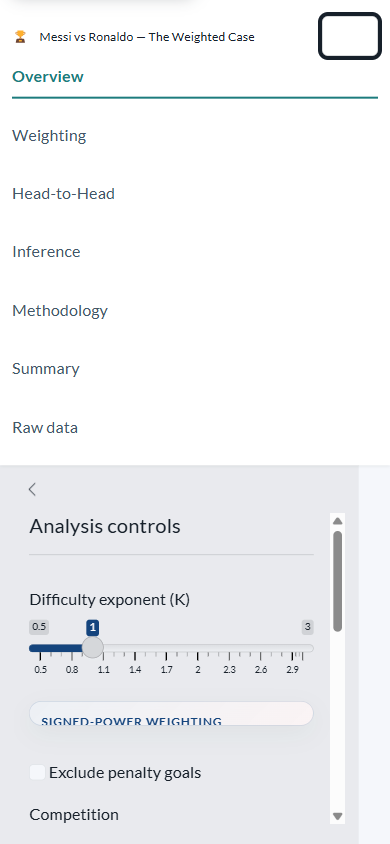
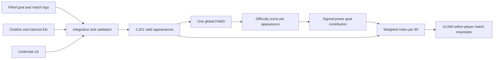

# Messi vs Ronaldo — The Weighted Case

An interactive R Shiny dashboard that compares Lionel Messi and Cristiano
Ronaldo using difficulty-adjusted scoring rates, transparent uncertainty, and
the complete valid-minute denominator — including scoreless appearances.

[](https://qqxot9-batest-hommie.shinyapps.io/messi-vs-ronaldo-r/)
[](https://www.r-project.org/)
[](https://shiny.posit.co/)
[](DOCKER.md)

**[Open the public dashboard](https://qqxot9-batest-hommie.shinyapps.io/messi-vs-ronaldo-r/)**
· **[Read the illustrated study guide](output/pdf/Messi_vs_Ronaldo_Statistics_Explained.pdf)**
· **[Explore the architecture](docs/ARCHITECTURE.md)**



## Why this project exists

Raw goal totals treat every goal as if it happened in the same context. This
project asks a narrower question: how does the comparison change when scoring
output is weighted by opponent strength, venue, competition stage, and away
status?

The result is a **difficulty index**, not a new literal goal count and not a
universal winner declaration. The dashboard keeps raw rates beside weighted
rates, exposes the full bootstrap distribution, and reports uncertainty without
binary significance labels.

## Dashboard tour

| Page | What it provides |
|---|---|
| **Overview** | Player profiles, dataset club journeys, and the fixed career baseline |
| **Weighting** | K-sensitivity, raw-vs-weighted comparison, score density, and difficulty deciles |
| **Head-to-Head** | Competition/venue scopes, career trajectories, continuous opponent Elo, and penalty composition |
| **Inference** | Button-frozen 10,000-resample match bootstrap, percentile interval, directional probability, effect size, and subgroup tables |
| **Methodology** | Data provenance, one global FAMD, signed-power weighting, denominators, and limitations |
| **Summary** | Fixed reference and live selected-scope tables by era, competition family, and venue |
| **Raw data** | Searchable 1,738 × 29 goal-level source table and exact CSV download |

### Interactive analysis

| Weighting lab | Match-level inference |
|---|---|
|  |  |

The interface is responsive and keyboard-aware. On narrow screens, the full
navigation and analysis controls remain available without page-level horizontal
overflow.

<p align="center">
  
</p>

## Verified dataset and results

The dashboard is a fixed research snapshot covering 2002–2026, not a live feed
of current official career totals.

| Data contract | Verified value |
|---|---:|
| Goal records | 1,738 |
| Messi goals | 847 |
| Ronaldo goals | 891 |
| Valid appearances | 2,201 |
| Valid minutes | 181,081 |
| Scoreless appearances retained | 1,063 |
| Goals with Understat xG | 483 |
| Goals missing match-context difficulty | 3 |
| Source CSV MD5 | `c43c3f995b1f301b4328c846eab2cf27` |

### Default career comparison

Default settings are K = 1, penalties included, all competitions, and all
venues.

| Metric per 90 | Messi | Ronaldo | Messi − Ronaldo |
|---|---:|---:|---:|
| Difficulty-weighted index | 0.1337 | 0.0384 | +0.0953 |
| Raw goals | 0.8954 | 0.8357 | +0.0597 |

The seeded match bootstrap produces:

| Uncertainty measure | Result |
|---|---:|
| Observed weighted-index gap per 90 | +0.0953 |
| 95% percentile interval | [-0.0120, +0.1999] |
| Bootstrap P(gap > 0) | 0.960 |
| Match-level Cohen's d | +0.090 |

The interval crosses zero even though 96% of resampled differences are above
zero. The dashboard reports both facts and deliberately avoids a
“significant/not significant” or winner badge.

## Method in one view



One global Factor Analysis of Mixed Data (FAMD) is fitted across both players'
valid appearances using only:

- opponent Elo;
- venue;
- competition stage; and
- away status.

The sensitivity control applies signed power to the stored score:

```text
WG_K = sign(Difficulty_Score) × |Difficulty_Score|^K
```

Signed power is essential because the centred difficulty score can be negative
and fractional K values would otherwise produce `NaN`. The primary rate is:

```text
weighted index per 90 = sum(selected-K goal contributions)
                        ---------------------------------- × 90
                        sum(all valid appearance minutes)
```

Scoreless appearances therefore contribute zero to the numerator and remain in
the denominator. Inference independently resamples complete appearances within
each player, preserving each player's selected-scope appearance count in every
replicate. See [Architecture and methodology](docs/ARCHITECTURE.md) for the
full data flow and runtime contracts.

## Project structure

```text
app/                 modular bslib dashboard and precomputed runtime data
R/                   shared scraping, browser access, and slug utilities
scripts/             numbered collection, integration, analysis, docs, deployment
data/                source documentation and processed research outputs
tests/               Wave 4–8 numerical, UI-contract, Docker, and deployment checks
docs/                 architecture documentation and README screenshots
output/pdf/           distribution-ready illustrated study guide
output/word/          editable study-guide source
Dockerfile            pinned, non-root, multi-stage runtime image
```

The app never scrapes or runs FAMD at startup. It loads the precomputed
`app/data/analysis_bundle.rds` and exact goal CSV, then performs only scoped
arithmetic, plotting, table rendering, and explicitly triggered bootstrap work.

## Run locally

### Prerequisites

- R 4.5.x (developed on R 4.5.2)
- the six runtime packages: `shiny`, `bslib`, `data.table`, `htmltools`,
  `plotly`, and `DT`

Install the runtime packages from an interactive R console if needed:

```r
install.packages(c("shiny", "bslib", "data.table", "htmltools", "plotly", "DT"))
```

From the repository root:

```powershell
Rscript app/run.R
```

Then open <http://127.0.0.1:3838/>.

> **Important:** launch through `app/run.R`. Running `Rscript app/app.R`
> directly does not reliably serve `app/www/` static assets.

This project deliberately has no `renv` environment. The app runtime is six
packages, Docker uses a dated Posit Package Manager snapshot, and the
precomputed analysis bundle records the package versions that produced it.

## Rebuild the analysis bundle

The checked-in runtime bundle is already ready to use. To rebuild it from the
processed Phase 1 outputs, install the local analysis dependencies listed in
`R/_packages.R`, then run:

```powershell
Rscript scripts/08_prepare_analysis.R
```

FAMD is local analysis work only; it is not a dashboard or container runtime
dependency. Phase 1 collection scripts are numbered and preserve immutable
raw inputs. FBref access requires the documented persistent headful-Chrome
workflow in `R/browser_scrape.R`.

## Tests

Run the retained regression suites from the repository root:

```powershell
Rscript tests/wave4_inference_checks.R
Rscript tests/wave5_content_checks.R
Rscript tests/wave6_polish_checks.R
Rscript tests/wave7_container_checks.R
Rscript tests/wave8_deployment_checks.R
```

The final verified run passes all five suites. It reasserts the seeded
bootstrap distribution, raw-data hash, signed-power behavior, all-valid-minute
denominators, responsive/accessibility contracts, pinned container design, and
strict shinyapps.io deployment allowlist.

## Docker

The multi-stage image uses `rocker/shiny-verse:4.5.0` pinned by digest, installs
the six runtime packages from the dated 2026-08-09 Posit snapshot, runs as the
non-root `shiny` user, exposes port 3838, and includes an HTTP health check.

```powershell
docker build -t messi-vs-ronaldo:latest .
docker run --rm --name messi-vs-ronaldo -p 3838:3838 --memory 2g --cpus 1 --cap-drop ALL --security-opt no-new-privileges messi-vs-ronaldo:latest
```

See [DOCKER.md](DOCKER.md) for the verified build, security, health, and cleanup
contracts.

## Deployment

The public app is hosted on shinyapps.io. Deployment uses a strict 24-file
allowlist and refuses development-only packages, secrets, and unlinked remote
overwrites.

After configuring `rsconnect` credentials in the user-level credential store:

```powershell
Rscript scripts/09_deploy_shinyapps.R
```

Never commit a token, secret, or `app/rsconnect/` record. The deployment record
is intentionally ignored so local updates remain linked without exposing
account metadata.

## Data limitations and interpretation

- The dashboard snapshot ends in 2026 and does not claim current official
  career totals.
- Three 2026 World Cup goals lack match-log context. They stay in raw counts
  but contribute zero to weighted numerators.
- Understat xG covers 483 goals, mainly 2014+ top-five European leagues; xG is
  disclosed but is not part of the current difficulty weight.
- Opponent Elo uses direct club/national ratings where available, then a
  documented league-average fallback, then global 1500. No row is dropped.
- Difficulty scores are centred index units and may be negative; they are not
  negative literal goals.
- FAMD compresses several contextual variables into one dimension. The index
  is a transparent analytical lens, not a complete model of football quality.
- Bootstrap intervals describe match-sampling variation under the selected
  model and scope; they do not cover every plausible model specification.

## Documentation

- [Simple statistics study guide — PDF](output/pdf/Messi_vs_Ronaldo_Statistics_Explained.pdf)
- [Editable study guide — Word](output/word/Messi_vs_Ronaldo_Statistics_Explained.docx)
- [Architecture and methodology](docs/ARCHITECTURE.md)
- [Project closeout and reusable skills](docs/PROJECT_CLOSEOUT.md)
- [Data dictionary](data/data_dictionary.md)
- [Docker guide](DOCKER.md)
- [Image and club-mark attributions](app/www/ATTRIBUTIONS.md)
- [Phase 2 implementation plan](.opencode/plans/phase2-plan.md)
- [Final implementation handoff](.opencode/plans/phase2-handoff.md)

## Attribution and reuse

Player images and club marks have separate source, copyright, and trademark
notes in [ATTRIBUTIONS.md](app/www/ATTRIBUTIONS.md). Club marks are used only
for identification and commentary.

No project-wide open-source license has been declared. Do not assume permission
to redistribute the code, data, or visual assets unless an appropriate license
is added and the underlying source terms are reviewed.

## Project status

Phase 1 data collection and Phase 2 dashboard Waves 0–8 are complete. The
dashboard was publicly deployed and fully reverified on 2026-08-15. The
canonical project remains on the D: drive; no temporary C: project copy is
required for normal use. Local Shiny and Docker services are stopped, the
repository is public, and the final operational state is recorded in the
[project closeout](docs/PROJECT_CLOSEOUT.md).
