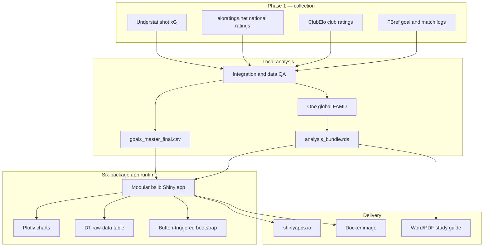

# Architecture and Methodology

This document describes how the Messi vs Ronaldo research pipeline becomes a
public, reproducible Shiny dashboard. It complements the beginner-oriented
[study guide](../output/pdf/Messi_vs_Ronaldo_Statistics_Explained.pdf) and the
operational [README](../README.md).

## System overview



The public runtime performs no scraping and does not fit FAMD. Statistical
artifacts are prepared locally, stamped with source/package metadata, and
shipped with the application.

## Collection and integration

The numbered scripts form the data pipeline:

| Stage | Responsibility |
|---|---|
| `02_scrape_fbref.R` | Goal logs, complete match logs, and season data through a persistent Chrome session |
| `03_scrape_understat.R` | Shot-level xG for supported competitions and dates |
| `04_collect_elo_ratings.R` | National Elo first, then retryable club Elo collection |
| `05_scrape_transfermarkt.R` | Supplemental cached source collection |
| `07_integrate_data.R` | Cleaning, joins, Elo fallbacks, one global FAMD, processed outputs, and QA report |
| `08_prepare_analysis.R` | Dashboard-ready bundle plus byte-identical app CSV copy |

Raw collection data is immutable. Cleaning and feature construction happen in
processed outputs. FBref's managed challenge requires `R/browser_scrape.R`, a
persistent headful Chrome profile, and cached HTML; plain `httr`/`rvest` access
is not sufficient.

### Integration invariants

- Goal and appearance context join on player, date, competition, round, and
  cleaned opponent.
- Repeated FBref header/spacer rows and DNP rows are removed.
- Zero-goal appearances are retained.
- Opponent Elo never causes row loss. Fallback order is club/national direct,
  league average, then global 1500.
- Understat goals join by within-player/date goal rank because source minute
  notation differs.
- Three goals without match context remain visible with missing difficulty.

## Statistical design

### Global FAMD

One Factor Analysis of Mixed Data is fitted on the combined valid-appearance
dataset for both players. Separate player models would create incompatible
scales and are prohibited.

Inputs are limited to:

1. `Opponent_Elo` — continuous;
2. `Venue` — categorical;
3. `Competition_Stage` — categorical; and
4. `Is_Away` — categorical/logical.

Goal count, player identity, and the player's own team Elo are excluded. The
oriented standardized first-dimension score is stored as `Difficulty_Score`.

### Signed-power sensitivity

At K = 1, each eligible goal contributes its stored difficulty score. The
interactive sensitivity setting is:

```text
WG_K = sign(Difficulty_Score) × |Difficulty_Score|^K
```

This preserves the direction of centred scores and remains finite for
fractional K. Penalty exclusion changes goal contributions only; it never
removes appearance minutes.

### Ratio-of-sums rate

For player `p` in selected scope `s`:

```text
                  Σ weighted goal contributions(p, s)
weighted / 90 =   ----------------------------------- × 90
                  Σ valid appearance minutes(p, s)
```

Every valid selected-scope appearance contributes minutes. Scoreless matches
therefore contribute a zero numerator and remain in the denominator. A missing
difficulty goal contributes zero weighted index units but remains disclosed in
raw data and coverage counts.

### Match bootstrap

Inference runs only when **Update analysis** is selected. That click freezes K,
penalty, competition, and venue settings. Control changes afterward show a
stale-state message and do not rerun the bootstrap.

For each of 10,000 replicates:

1. resample complete appearances with replacement independently within Messi;
2. preserve Messi's selected-scope appearance count;
3. repeat independently for Ronaldo;
4. calculate each player's ratio-of-sums weighted index per 90; and
5. record Messi minus Ronaldo.

Seed `20260812` makes the distribution deterministic. The application reports
the 2.5%/97.5% percentile interval, share of differences above zero, and
conventional pooled-SD Cohen's d on appearance-level weighted rates. It does
not calculate p-value verdicts or apply multiplicity labels.

## Runtime data contracts

### Exact source table

`goals_master_final.csv` contains 1,738 unique goal rows and 29 original
source/derived fields. The app copy must match the processed source byte for
byte; the verified MD5 is `c43c3f995b1f301b4328c846eab2cf27`.

### Analysis bundle

The retained bundle version is 0.1.0 with these top-level objects:

| Object | Purpose |
|---|---|
| `goals` | Goal-level difficulty, era, penalty, xG, and display fields |
| `matches` | Clean appearance context |
| `valid_matches` | Full valid-minute denominator population |
| `per90` | Fixed reference rates |
| `trajectory` | Career-sequence inputs |
| `boot_input` | Appearance-level bootstrap contributions |
| `famd_info` | Stored model metadata and contribution summaries |
| `meta` | Counts, build stamp, hashes, and package versions |
| `version` | Bundle schema version |

Tests assert 2,201 valid appearances, 181,081 minutes, 1,063 scoreless
appearances, and three missing difficulty scores.

## Dashboard architecture

`app/app.R` creates one shared `reactiveValues` state and delegates each page
to a Shiny module. External module interfaces remain stable:

```r
mod_<page>_ui(id)
mod_<page>_server(id, state)
```

| Module | Main responsibility |
|---|---|
| `mod_overview.R` | Fixed baseline and player/club presentation |
| `mod_weighting.R` | Selected-K sensitivity and difficulty distributions |
| `mod_head2head.R` | Selected-scope trajectories, continuous Elo, and penalty composition |
| `mod_inference.R` | Frozen snapshots, deterministic bootstrap, density, and subgroups |
| `mod_methodology.R` | Provenance and analytical explanation |
| `mod_summary.R` | Fixed and live semantic comparison tables |
| `mod_data.R` | Exact source DT and download |

Shared controls update only their documented consumers:

| Control | Immediate consumers | Button-frozen consumer |
|---|---|---|
| K | Weighting, Head-to-Head, live Summary | Inference |
| Penalty exclusion | Weighting, Head-to-Head, live Summary | Inference |
| Competition | Head-to-Head, live Summary | Inference |
| Venue | Head-to-Head, live Summary | Inference |

Overview, Methodology, fixed Summary, and Raw Data remain stable reference
surfaces. Wide semantic/DT tables scroll inside their containers rather than
expanding the document.

### Performance and accessibility

- Eight Plotly outputs use `shiny::bindCache()`.
- Bootstrap results are cached by the frozen control snapshot.
- Native Shiny busy feedback avoids another package dependency.
- Offline MathML replaces CDN MathJax.
- The page includes a keyboard skip link, focus styles, polite loading status,
  meaningful image alt text, semantic tables, and reduced-motion rules.
- Desktop and mobile browser checks assert exact document width, zero Shiny
  output errors, and zero console warnings/errors.

## Runtime and delivery

### Local application

Always launch through:

```powershell
Rscript app/run.R
```

The launcher resolves `app/` from its own location, validates host/port values,
detects an occupied port, logs JSON lifecycle events to stdout, and ensures
`app/www/` assets are served correctly.

### Docker

The two-stage image:

- pins `rocker/shiny-verse:4.5.0` by digest;
- installs exactly six runtime packages from a dated Posit snapshot;
- copies only `app/` into the runtime image;
- runs as non-root `shiny`;
- provides an HTTP health check; and
- contains no scraper or FAMD dependency.

The verified image was 786,851,392 bytes, below the 1.5 GB target. See
[DOCKER.md](../DOCKER.md) for build and cleanup details.

### shinyapps.io

`scripts/09_deploy_shinyapps.R` validates a strict 24-file allowlist and the
six-package manifest before deployment. Credentials remain in the user's
rsconnect store and `app/rsconnect/` is ignored. The public deployment is:

<https://qqxot9-batest-hommie.shinyapps.io/messi-vs-ronaldo-r/>

## Verification strategy

The retained suites form a layered acceptance contract:

| Suite | Coverage |
|---|---|
| Wave 4 | Join grain, bootstrap determinism, seeded values, scopes, and empty states |
| Wave 5 | Methodology/Summary/Raw Data values, schema, source hash, and download |
| Wave 6 | Caching, loading behavior, accessibility, responsive tokens, and module APIs |
| Wave 7 | Docker pinning, package boundary, non-root runtime, health check, and unchanged data |
| Wave 8 | Deployment allowlist, secret exclusion, app dependencies, and source contracts |

The final default inference contract is gap `0.0952554179`, interval
`[-0.0119600327, 0.1999414634]`, probability `0.9600000000`, and Cohen's d
`0.0899711631`.

## Deliberate boundaries

- No per-player FAMD models.
- No goal-only denominator.
- No plain fractional power of negative scores.
- No runtime scraping or model fitting.
- No p-value or binary winner flag.
- No trajectory-slope regression.
- No renv project environment.

These boundaries keep the comparison reproducible, interpretable, responsive,
and honest about what one contextual index can and cannot establish.
